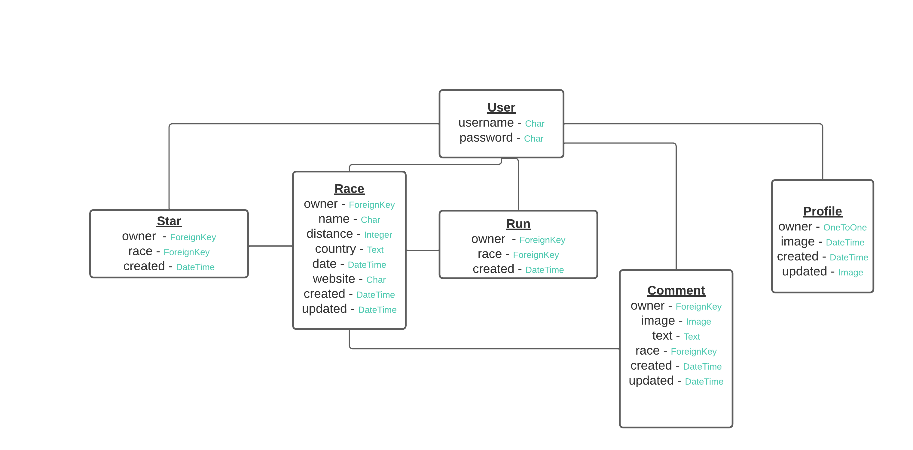

# eRace API

### Project description 

As a runner, you become part of a global community. A running race brings together participants from all over the world, not only to compete with, but also to socialize and motivate each other.

eRace is a web browser application for where runners can find and inform each other of races worldwide. The database is provided by the community in two stages per race: First, one user provides a small set of basic facts (place, time, etc.). Second, any user may add additional facts in text or image form.

The application has been designed specifically with use on mobile devices in mind.

## Project Goals

Finding a race — Whether you are looking for a picturesque trail run near you, or going for a holiday and want to find a run in that specific country, you can find it by searching this crowd sourced repository.

Joining the buzz — Share your insights with your fellow users and gain new insights from them. 

Keeping a record — Your past races are displayed separately for easy access and ego boost.

Scheduling races to come — Your next upcoming race is always presented after sign in and a chronological list of all upcoming races is easily accessible.

## User stories 

- As a user I should be logged in to access the site.
- As a user I want a friendly interface.
- As a user I want to be able to edit the race I have added.
- As a user I want to be able to see all information about a race and add to it.
- As a user I want to be able to see the races I am interested in.
- As a user I want to be able to search on a country to see upcoming races in that specific country.
- As a user I want to be able to see my past and upcoming races.
- As a user I want to be able to sign up and to sign in with username and password so that I can access my account.
- As a user I want to be able to add a race I’m interested in, I will attend or I want to recommend.
- As a user I want to be able to mark races so that I can easily see the ones I’m interested in or will attend.
- As a user I want to be able to see details about my next upcoming race so that I get an extra push.
- Add a README file.

## Entity Relationship Diagram

## Model and CRUD breakdown 

| Model | Endpoints | Create | Retrieve | Update | Delete | Filter | Text search |
|-----|-----|-----|-----|-----|-----|-----|-----| 
| User | users/ users/:id/ | Yes | Yes | Yes | No | No | No |
| Profile | profiles/ profiles/:id/ | Yes (auto) | Yes | Yes | No | No | No |
| Race | races/ races/:id/ | Yes | Yes | Yes | No | Star Run | Country |
| Comment | comments/ comment/:id/ | Yes | Yes | No | Yes | Run | No |
| Run | runs/ runs/:id/ | Yes | Yes | No | Yes | No | No |
| Star | stars/ stars/:id/ | Yes | Yes | No | Yes | No | No |

## Tests

Logged in users can: 
- create a race/comment/run/star
- update a race they own

Logged in users can't:  
- update a race they don't own
- update a comment/run/star

Logged out users can:  
- list races/comments/runs/stars
- retrieve a race/comment/run/star with a valid id

Logged out users can't:  
- create a race/comment/run/star
- retrieve a race/comment/run/star with an invalid id

Tests were preformed using Postman and the Erace application frontend.

## Pre-deployment checklist

- Set default renderer to JSON 
- Verify that Procfile contains correct release and web commands
- Verify that DEBUG is set to False
- Verify that requirements.txt is up to date.

## Deployment steps

The application is deployed on Heroku.

The following environment variables are defined:

| Variable | Value |
|-----|-----| 
| ALLOWED_HOST | erace-api.herokuapp.com |
| CLIENT_ORIGIN | https://erace-client.herokuapp.com |
| CLOUDINARY_URL | cloudinary://... |
| SECRET_KEY | ... |

## Credits

- [Code Institute](https://codeinstitute.net/) has through out the course provided me with various code solutions large and small that I have reused freely.  

- [Instructions](https://docs.google.com/document/d/1P5CWvS5cYalkQOLeQiijpSViDPogtKM7ZGyqK-yehhQ/edit) on Heruko and Django

- [Slackoverflow](https://stackoverflow.com/) helped me out with code solutions throughout the project